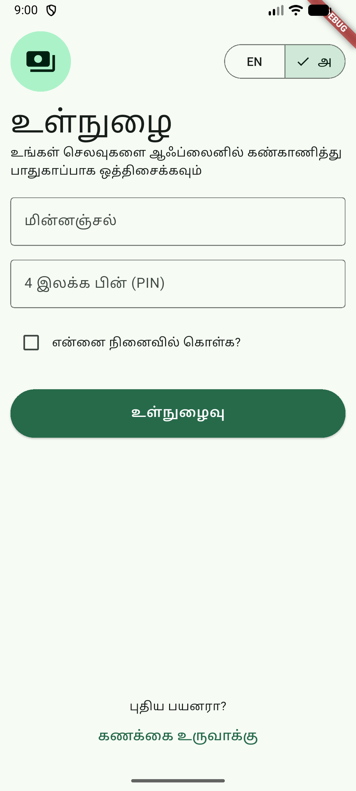
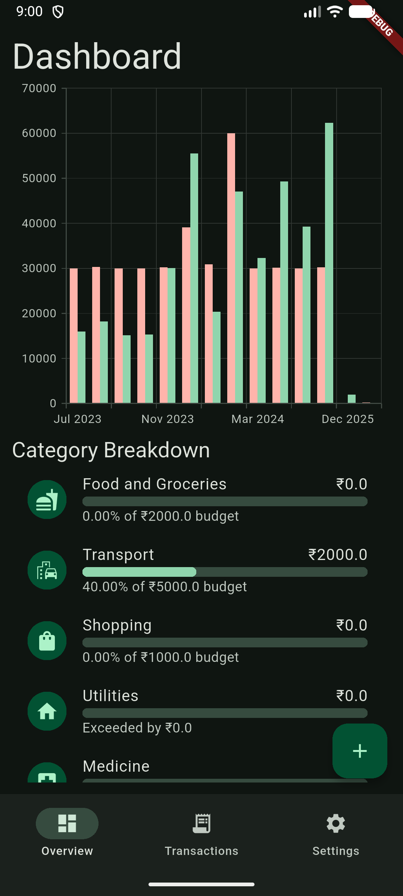
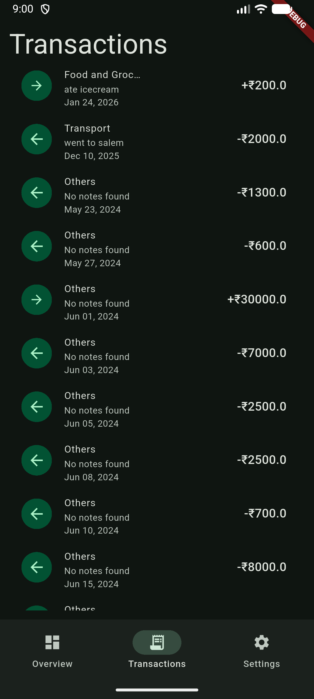
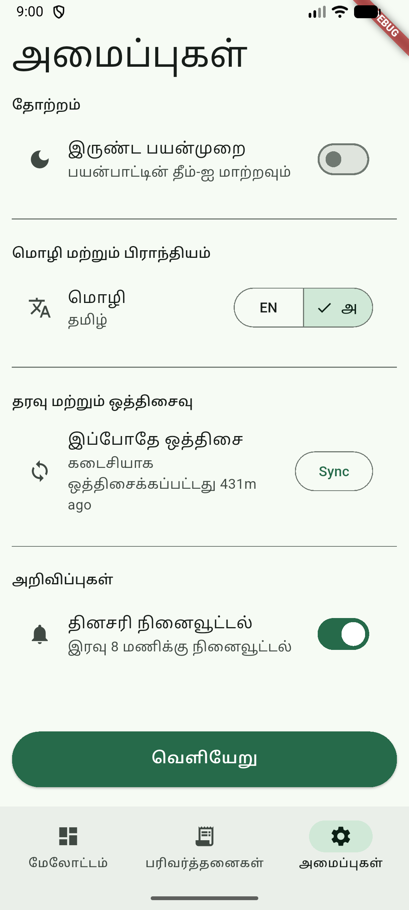
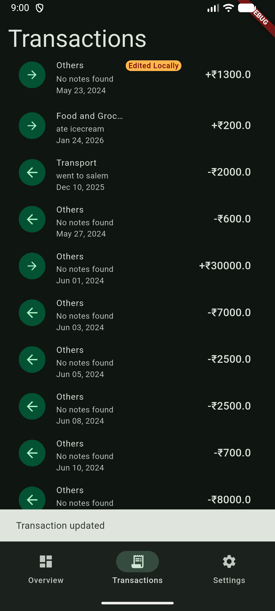

# habit_wallet_lite


A new Flutter project.

## Screenshots

Login Page             |  Dashboard
:-------------------------:|:-------------------------:
  |  


Transaction             |  Settings Light
:-------------------------:|:-------------------------:
  |  

Transaction edited             |
:-------------------------:|



## Building

* Setup the Flutter environment for your platform.

* Clone the repository.

* Get dependencies.
```
flutter pub get
```

* Generate files.
```
dart run build_runner build or watch
```

* Run the app.
```
flutter run
```


